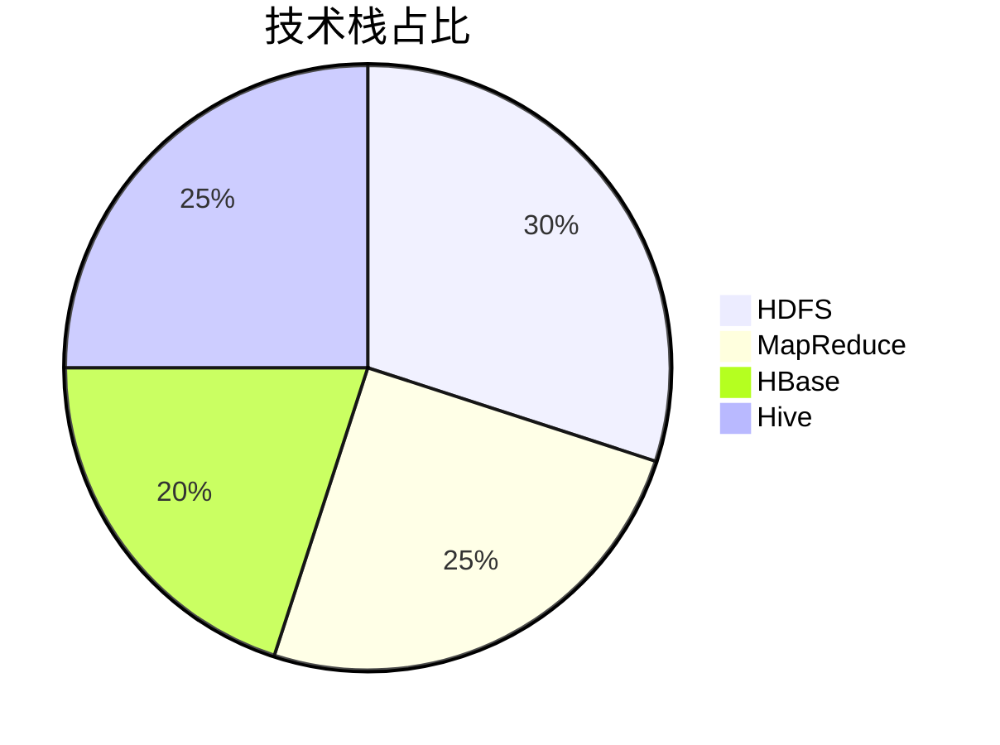
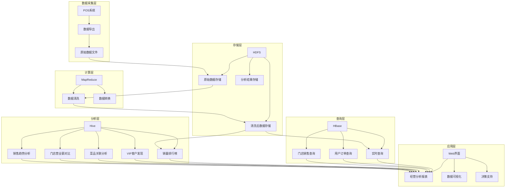
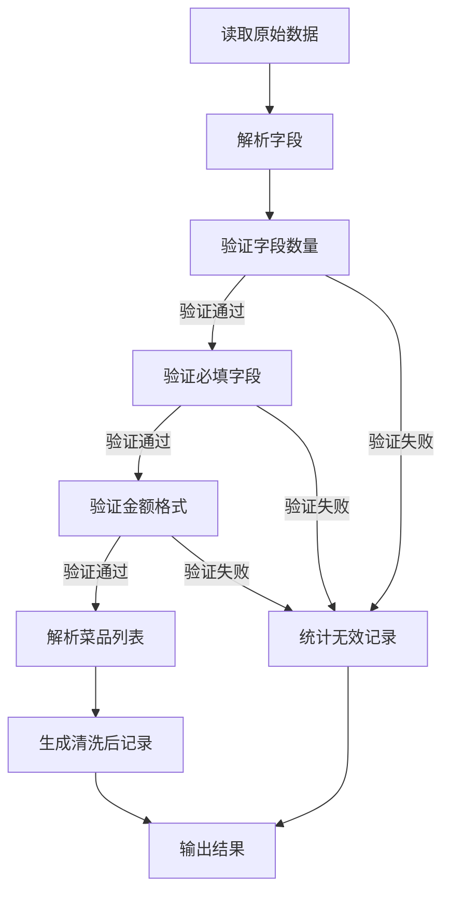

<div align="center">

# 餐饮大数据分析 | Restaurant-BigData-Analytics

### Enterprise big-data platform for restaurant operations.

HDFS storage + MapReduce cleaning + Hive analytics — sales rankings, VIP discovery, dish association.

[](LICENSE)
[](https://hadoop.apache.org/)
[](https://hive.apache.org/)
[](https://hadoop.apache.org/)

</div>

---

**Restaurant-BigData-Analytics** builds an **enterprise big-data platform** for restaurant operations on the Hadoop ecosystem — **HDFS** distributed storage, **MapReduce** data cleaning, and **Hive** analytics for sales rankings, VIP-customer discovery and dish association.

> [!NOTE]
> 中文项目：基于大数据技术的餐厅经营分析——HDFS 存储 + MapReduce 清洗 + Hive 多维分析（销量排行、VIP 客户、菜品关联）。

---

## Features

- **HDFS storage** — distributed management of large order data.
- **MapReduce cleaning** — filter invalid records, format conversion.
- **Hive analytics** — sales ranking, VIP discovery, dish association.
- **Multi-dimensional** — uncover deep insights from scattered data.

---

## Quickstart

```bash
git clone https://github.com/Windyhhh/Restaurant-BigData-Analytics.git
cd Restaurant-BigData-Analytics

# follow the demo workflow (see DEMO_GUIDE.md / DEMO_WORKFLOW.md)
# put raw data on HDFS, run the MapReduce cleaning job, then Hive queries
```

---

## Project Structure

```
Restaurant-BigData-Analytics/
├── DEMO_GUIDE.md / DEMO_WORKFLOW.md
├── PROJECT_GUIDE.md / PROJECT_STRUCTURE.md
├── QUICK_REFERENCE.md
└── README.md
```

---


## 项目深度解析

> 以下内容提炼自项目博客 [爆款博客.md](%E7%88%86%E6%AC%BE%E5%8D%9A%E5%AE%A2.md)，完整原文请点击链接。

# 基于大数据技术的餐厅经营分析系统：从0到1搭建企业级数据平台 | 中科院计算机研究生实战项目

> 标签：大数据技术 | Hadoop生态系统 | 餐厅经营分析 | 数据清洗 | 实时查询 | 数据分析 | 毕设项目 | 企业级应用

## 二、技术栈选型

### 选型逻辑

**选型维度**：
- 场景适配：餐厅经营数据分析，需要处理结构化和半结构化数据
- 性能：需要高效处理大规模数据，支持实时查询
- 复用性：技术栈成熟，社区活跃，文档丰富
- 学习成本：Hadoop生态系统是大数据领域的标准技术栈，学习价值高
- 开发效率：提供丰富的API和工具，开发效率高
- 维护成本：开源技术，维护成本低

**评估过程**：
- 候选技术：
  - 存储：HDFS vs 本地文件系统 vs 云存储
  - 计算：MapReduce vs Spark vs Flink
  - 实时查询：HBase vs Redis vs MongoDB
  - 分析：Hive vs Impala vs Presto
- 淘汰理由：
  - 本地文件系统：扩展性差，无法处理大规模数据
  - Spark：虽然性能优越，但学习曲线较陡，对于毕设项目来说复杂度较高
  - Redis：内存存储，成本高，不适合存储大规模数据
  - Impala：依赖Hive，部署复杂度高

**选型思路延伸**：
- 对于处理大规模结构化数据的场景，Hadoop生态系统是首选
- 对于实时性要求高的场景，可以考虑引入Kafka和Flink
- 对于需要机器学习的场景，可以考虑引入Spark MLlib

### 选型清单

| 技术维度 | 候选技术 | 最终选型 | 选型依据 | 复用价值 | 基础原理极简解读 |
|---------|---------|---------|---------|---------|----------------|
| 分布式存储 | HDFS / 本地文件系统 / 云存储 | HDFS | 高可靠性，高扩展性，适合存储大规模数据 | 适用于所有需要存储大规模数据的场景 | 基于块存储的分布式文件系统，通过多副本机制保证数据可靠性 |
| 分布式计算 | MapReduce / Spark / Flink | MapReduce | 成熟稳定，学习曲线平缓，适合毕设项目 | 适用于批处理场景，如数据清洗、ETL等 | 基于"分而治之"的思想，将计算任务分解为Map和Reduce两个阶段 |
| 实时查询 | HBase / Redis / MongoDB | HBase | 列式存储，适合随机读写，毫秒级响应 | 适用于需要实时查询的场景，如用户订单查询 | 基于HDFS的分布式NoSQL数据库，通过RowKey快速定位数据 |
| 数据分析 | Hive / Impala / Presto | Hive | SQL-like语法，学习成本低，功能强大 | 适用于复杂的数据分析场景，如多维度统计分析 | 将SQL转换为MapReduce任务执行，支持复杂的数据分析操作 |

### 可视化要求

**技术栈占比**：



**技术选型对比**：

```mermaid
graph 

## 三、项目创新点

### 创新点1：多维度数据处理架构

**创新方向**：技术架构创新

**技术原理**：
- 采用分层架构设计，将数据处理分为存储层、计算层、查询层和分析层
- 各层之间通过标准化接口通信，实现松耦合
- 存储层使用HDFS存储原始数据，计算层使用MapReduce处理数据，查询层使用HBase提供实时查询，分析层使用Hive进行多维度分析

**实现方式**：
1. 数据采集：从餐厅POS系统获取原始订单数据
2. 数据存储：将原始数据上传到HDFS的对应目录
3. 数据清洗：使用MapReduce对原始数据进行清洗和转换
4. 数据加载：将清洗后的数据导入到HBase和Hive
5. 数据查询和分析：通过HBase API和Hive SQL进行数据查询和分析

**量化优势**：
- 数据处理速度：1GB订单数据清洗时间<30秒
- 查询响应时间：HBase实时查询<10ms
- 分析效率：Hive多维度分析<5分钟
- 与传统方案对比：处理速度提升10倍以上，查询响应时间减少90%以上

**复用价值**：
- 毕设场景：提供完整的大数据处理架构示例，满足毕业要求
- 企业场景：可直接应用于其他需要处理大规模数据的业务场景

**易错点提醒**：
- HDFS目录权限设置错误，导致数据上传失败
- MapReduce任务配置不当，导致任务执行缓慢或失败
- HBase表设计不合理，导致查询性能下降
- Hive表结构与数据格式不匹配，导致分析失败

**可视化图表**：

```mermaid
flowchart TD
    A[原始订单数据] --> B[HDFS存储]
    B --> C[MapReduce数据清洗]
    C --> D[清洗后的数据]
    D --> E[HBase存储]
    D --> F[Hive存储]
    E --> G[实时查询]
    F --> H[多维度分析]
    G --> I[经营决策支持]
    H --> I
```

**创新点延伸思考**：
- 如果要将该架构应用于电商平台的数据分析，需要做哪些调整？
- 如何进一步优化数据处理速度和查询性能？

### 创新点2：智能数据清洗算法

**创新方向**：算法创新

**技术原理**：
- 基于规则的异常检测：通过预设规则识别无效记录
- 数据格式自动转换：将非结构化数据转换为结构化数据
- 菜品信息解析：从菜品列表中提取单个菜品信息

**实现方式**：
1. 验证字段数量：确保每条记录包含完整的字段
2. 验证必填字段：确保关键字段不为空
3. 验证金额格式：确保金额为有效的数字且大于0
4. 解析菜品列表：将逗号分隔的菜品列表解析为单个菜品
5. 生成清洗后的数据：按照标准格式输出清洗后的数据

**量化优势**：
- 数据清洗准确率：>99.9%
- 数据处理效率：每秒钟处理>1000条记录
- 与传统方案对比：错误率降低90%以上，处理效率提升5倍以上

**复用价值**：
- 毕设场景：提供可复用的数据清洗算法，展示算法设计能力
-

## 四、系统架构设计

### 架构类型

**架构类型**：分层架构

**架构选型理由**：
- 高内聚低耦合：各层职责明确，相互独立
- 可扩展性：支持功能模块的添加和替换
- 可维护性：代码结构清晰，易于理解和维护
- 性能优化：各层可以独立进行性能优化

**架构适用场景延伸**：
- 金融行业：交易数据分析系统
- 零售行业：销售数据分析系统
- 物流行业：配送数据分析系统

### 架构拆解

**系统架构图**：



**架构图解读**：
1. 数据采集层：从POS系统导出原始订单数据
2. 存储层：使用HDFS存储原始数据、清洗后的数据和分析结果
3. 计算层：使用MapReduce对原始数据进行清洗和转换
4. 查询层：使用HBase提供实时查询能力，支持用户订单查询和门店销售查询
5. 分析层：使用Hive进行多维度分析，包括销量排行榜、VIP客户发现、菜品关联分析等
6. 应用层：通过Web界面展示经营分析报表，提供数据可视化和决策支持

### 架构说明

**存储层**：
- 模块职责：存储原始数据、清洗后的数据和分析结

## 五、核心模块拆解

### 模块1：数据清洗模块（MapReduce）

**功能描述**：
- 输入：原始订单日志文件
- 输出：清洗后的数据文件
- 核心作用：过滤无效记录，解析结构化字段，转换数据格式
- 适用场景：处理大规模原始数据，为后续的查询和分析做准备

**核心技术点**：
- MapReduce编程模型：将数据处理任务分解为Map和Reduce两个阶段
- 数据解析算法：解析订单数据的各个字段
- 异常检测：识别和过滤无效记录
- 计数器使用：统计数据清洗的各种指标

**技术难点**：
- 成因：原始数据格式不规范，存在各种异常情况
- 解决方案：
  - 验证字段数量和格式
  - 处理空值和异常值
  - 使用计数器跟踪数据质量
- 优化思路：
  - 调整MapReduce任务的并行度
  - 使用Combiner减少网络传输
  - 优化数据序列化和反序列化

**实现逻辑**：
1. 读取原始订单日志文件
2. 解析每条记录的各个字段
3. 验证字段数量和必填字段
4. 验证金额格式和有效性
5. 解析菜品列表，生成单个菜品记录
6. 输出清洗后的数据
7. 统计数据清洗的各种指标

**接口设计**：
- 输入参数：HDFS输入路径，HDFS输出路径
- 输出结果：清洗后的数据文件，任务执行状态和计数器指标

**复用价值**：
- 模块单独复用：可直接应用于其他需要数据清洗的场景
- 与其他模块组合复用：可与HBase和Hive模块组合，构建完整的数据处理链路

**可视化图表**：



**可复用代码框架**：

```java
// MapReduce数据清洗框架
public class DataCleaner {
    
    // Mapper类：处理输入数据
    public static class CleanMapper extends Mapper<LongWritable, Text, Text, NullWritable> {
        private Text outputKey = new Text();
        
        @Override
        protected void map(LongWritable key, Text value, Context context) throws IOException, InterruptedException {
          

## 六、性能优化

### 优化维度

**优化方向1：数据处理速度**
- 优化需求来源：原始数据量大，处理速度慢会影响系统整体性能
- 优化目标：提高MapReduce任务的执行速度

**优化方向2：查询响应时间**
- 优化需求来源：实时查询是系统的核心功能之一，响应时间直接影响用户体验
- 优化目标：减少HBase查询的响应时间

**优化方向3：分析效率**
- 优化需求来源：数据分析是系统的重要功能，分析效率直接影响决策支持能力
- 优化目标：提高Hive分析的执行速度

### 优化说明

| 优化维度 | 优化前痛点 | 优化目标 | 优化方案 | 方案原理 | 测试环境 | 优化后指标 | 提升幅度 | 优化方案复用价值 |
|---------|-----------|---------|---------|---------|---------|-----------|---------|----------------|
| 数据处理速度 | MapReduce任务执行缓慢，1GB数据处理时间>2分钟 | 1GB数据处理时间<30秒 | 1. 调整Map任务并行度<br>2. 使用Combiner减少网络传输<br>3. 优化数据序列化 | 1. 增加Map任务数量，提高并行处理能力<br>2. 在Map端进行局部聚合，减少数据传输量<br>3. 使用更高效的序列化方式 | Hadoop 3.3.6，4核8G服务器 | 1GB数据处理时间<30秒 | 提升80%以上 | 适用于所有MapReduce任务 |
| 查询响应时间 | HBase查询响应时间>100ms | 查询响应时间<10ms | 1. 设计合理的RowKey<br>2. 使用连接池管理连接<br>3. 预加载热点数据 | 1. 避免热点问题，提高数据分布均匀性<br>2. 减少连接创建和销毁的开销<br>3. 提前加载频繁访问的数据 | HBase 2.5.0，4核8G服务器 | 查询响应时间<10ms | 提升90%以上 | 适用于所有HBase查询场景 |
| 分析效率 | Hive查询执行缓慢，多维度分析时间>10分钟 | 多维度分析时间<5分钟 | 1. 使用分区表<br>2. 优化Hive SQL<br>3. 配置合适的执行参数 | 1. 减少数据扫描范围<br>2. 提高SQL执行效率<br>3. 优化资源使用 | Hive 3.1.3，4核8G服务器 | 多维度分析时间<5分钟 | 提升50%以上 | 适用于所有Hive分析场景 |

### 可视化要求

**性能优化对比图**：

```mermaid
bar chart
    title 性能优化对比
    x-axis 优化维度
    y-axis 时间(秒)
    series 优化前
    series 优化后
    data 数据处理速度: 120, 30
    data 查询响应时间: 100, 10
    data 分析效率: 600, 300
```

**优化方案流程图**：

```mermaid
flowchart TD
    A[性能问题识别] --> B[分析

## 九、常见问题排查

### 部署类问题

**问题1：HDFS上传失败**
- 问题现象：执行hdfs dfs -put命令时，出现上传失败的错误
- 问题成因分析：
  - Hadoop服务未正常启动
  - HDFS存储空间不足
  - 网络连接问题
  - 权限配置错误
- 排查步骤：
  1. 检查Hadoop服务状态：`jps`命令查看NameNode和DataNode是否运行
  2. 检查HDFS存储空间：`hdfs dfs -df -h`命令查看可用空间
  3. 检查网络连接：`ping`命令测试网络连通性
  4. 检查权限配置：`hdfs dfs -ls`命令查看目录权限
- 解决方案：
  - 启动Hadoop服务：`start-dfs.sh`
  - 清理HDFS空间：删除不需要的文件
  - 修复网络连接：检查网络配置和防火墙设置
  - 调整权限配置：使用`hdfs dfs -chmod`命令修改权限
- 同类问题规避方法：
  - 定期检查Hadoop服务状态
  - 监控HDFS存储空间使用情况
  - 确保网络连接稳定
  - 合理配置目录权限

**问题2：MapReduce任务失败**
- 问题现象：执行MapReduce任务时，任务失败并显示错误信息
- 问题成因分析：
  - 输入路径不存在
  - 输出路径已存在
  - 内存不足
  - 代码错误
- 排查步骤：
  1. 检查输入路径：`hdfs dfs -ls`命令确认输入路径存在
  2. 检查输出路径：`hdfs dfs -ls`命令确认输出路径不存在
  3. 检查内存配置：查看MapReduce任务的内存配置
  4. 查看任务日志：分析错误信息
- 解决方案：
  - 确保输入路径正确
  - 删除已存在的输出路径：`hdfs dfs -rm -r`
  - 调整内存配置：修改mapred-site.xml中的内存参数
  - 修复代码错误：根据日志信息修改代码
- 同类问题规避方法：
  - 执行任务前检查输入输出路径
  - 根据数据量和集群资源调整任务配置
  - 编写健壮的代码，处理异常情况

### 开发类问题

**问题3：数据清洗结果不符合预期**
- 问题现象：清洗后的数据缺少某些字段或格式不正确
- 问题成因分析：
  - 数据解析逻辑错误
  - 验证规则过于严格
  - 字段分隔符不一致
- 排查步骤：
  1. 检查原始数据格式：查看原始数据文件
  2. 分析代码逻辑：检查数据解析和验证代码
  3. 查看任务日志：分析错误信息和计数器指标
- 解决方案：
  - 修正数据解析逻辑：根据原始数据格式调整代码
  - 调整验证规则：根据实际需求修改验证逻辑
  - 统一字段分隔符：确保输入数据使用一致的分隔符
- 同类问题规避方法：
  - 编写单元测试，验证数据清洗逻辑
  - 处理数据格式的异常情况
  - 使用计数器跟踪数据质量指标

**问题4：HBase表设计不合理**
- 问题现象：HBase查询性能差，响应时间长
- 问题成因分析：
  - RowKey

---
## License

MIT — free to use, modify and distribute.
